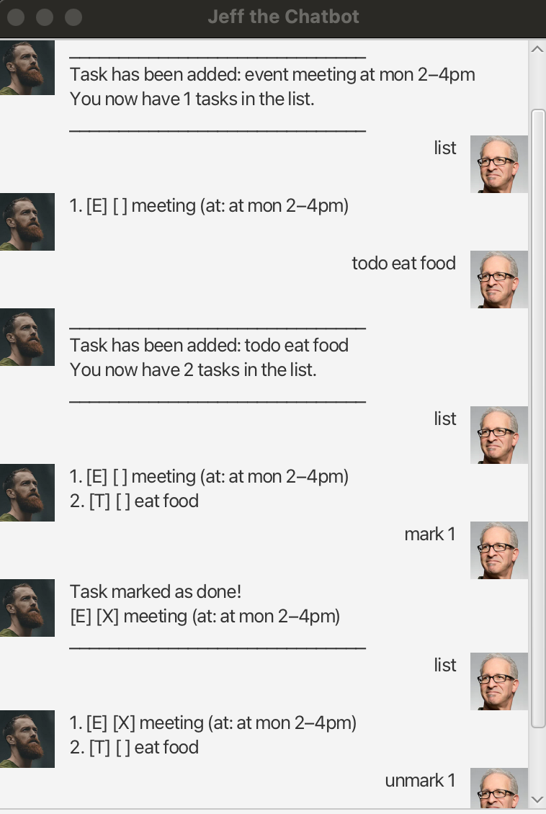

# Jeff User Guide

Jeff is a simple, friendly task chatbot. 
It helps you track tasks like: Todos, Deadlines, Events and more!
You can mark tasks as done, all via a GUI window.
Storage is local!

## Quick Start

- Run the app using your IDE.
- A window titled `Jeff the chatbot` opens. Type commands in the box at the bottom and press enter.
- Your task data is stored at `data/tasks.txt` file.

## Features and commands

### List tasks
- Format: `list`
- Shows all tasks with indices you can reference in other commands.

### Add a todo
- Format: `todo DESCRIPTION`
- Example: `todo buy milk`

### Add a deadline
- Format: `deadline DESCRIPTION by DATE_TIME`
- Example: `deadline submit iP by 2025-10-20 23:59`

### Add an event
- Format: `event DESCRIPTION at DATE_TIME`
- Example: `event project meeting at 2025-11-01 14:00`

### Find tasks
- Format: `find KEYWORD`
- Shows tasks whose descriptions contain the keyword.

### Mark or unmark a task
- Format: `mark INDEX` or `unmark INDEX`
- Example: `mark 1`

### Delete a task
- Format: `delete INDEX`
- Example: `delete 2`

### Fixed duration task
- Format: `fixedduration DESCRIPTION for HOURS hours`
- Example: `fixedduration revise CS for 3 hours`

### Exit
- Format: `bye`
- Closes the application window.

## Storage
- Data is saved automatically to `data/tasks.txt` after add, edit, or delete operations.
- If the file or folder does not exist, Jeff creates it automatically on first save.

Acceptable datetime formats:
- `yyyy-MM-dd HH:mm` (e.g., `2025-10-20 18:00`)

Jeff will show an error for strict commands. For events, if the datetime cannot be parsed, Jeff displays your original text in the UI so you still see what you typed.

